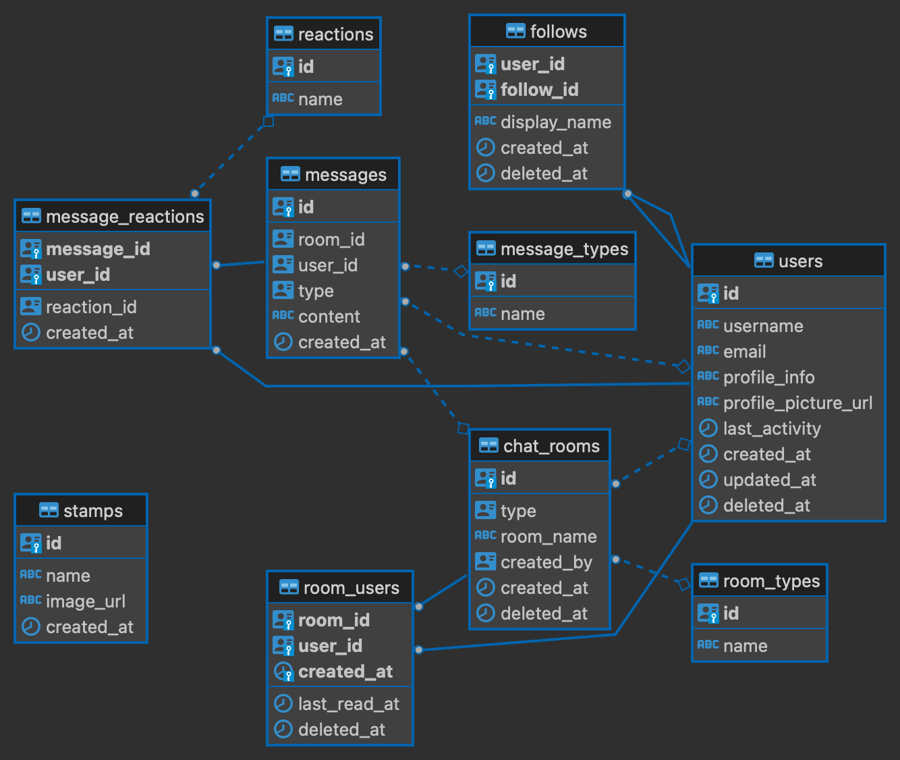

# db

db のマイグレーション定義などを配置する場所。

## ローカルでの起動

docker compose を使って起動する。

``` sh
# db(compose) の起動。
make db-up

# postgresql の中に入る。
make psql

# db(compose) の終了。
make db-down
```

## ER 図



## TODO

残課題

- マイグレート方法
  - デプロイ手段が決まり次第考える
