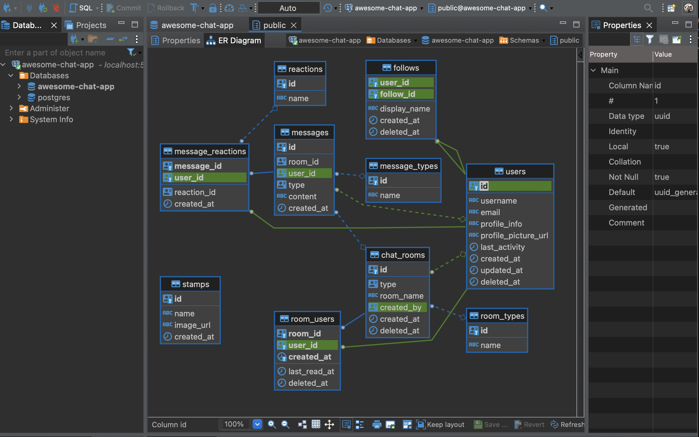

## ER 図作成手順

db の GUI ツールとして [dbeaver](https://github.com/dbeaver/dbeaver) を使用しています。

1. 最新の状態で起動中の db に dbeaver で接続
2. 下図の状態から右クリック > Save diagram ... を選択
3. [`er_diagram.png`](./er_diagram.png) を置き換える

